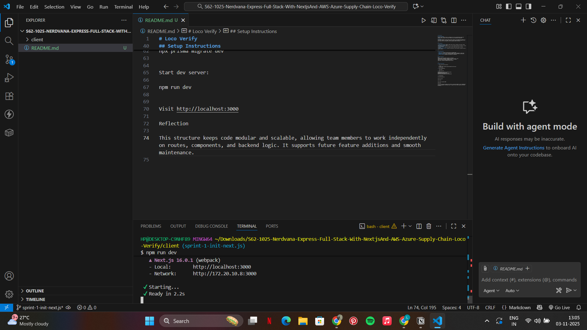
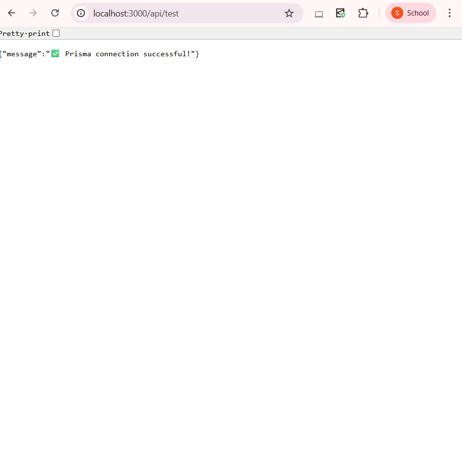
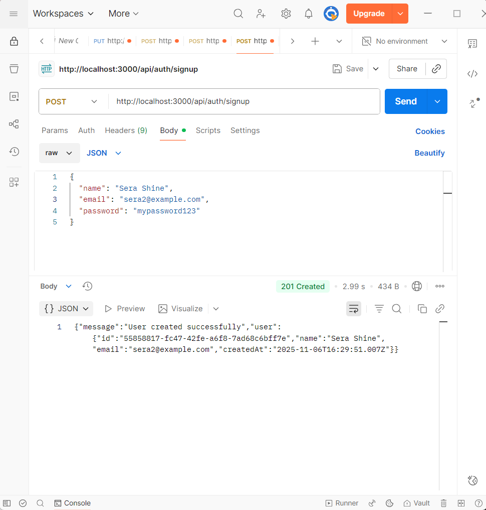
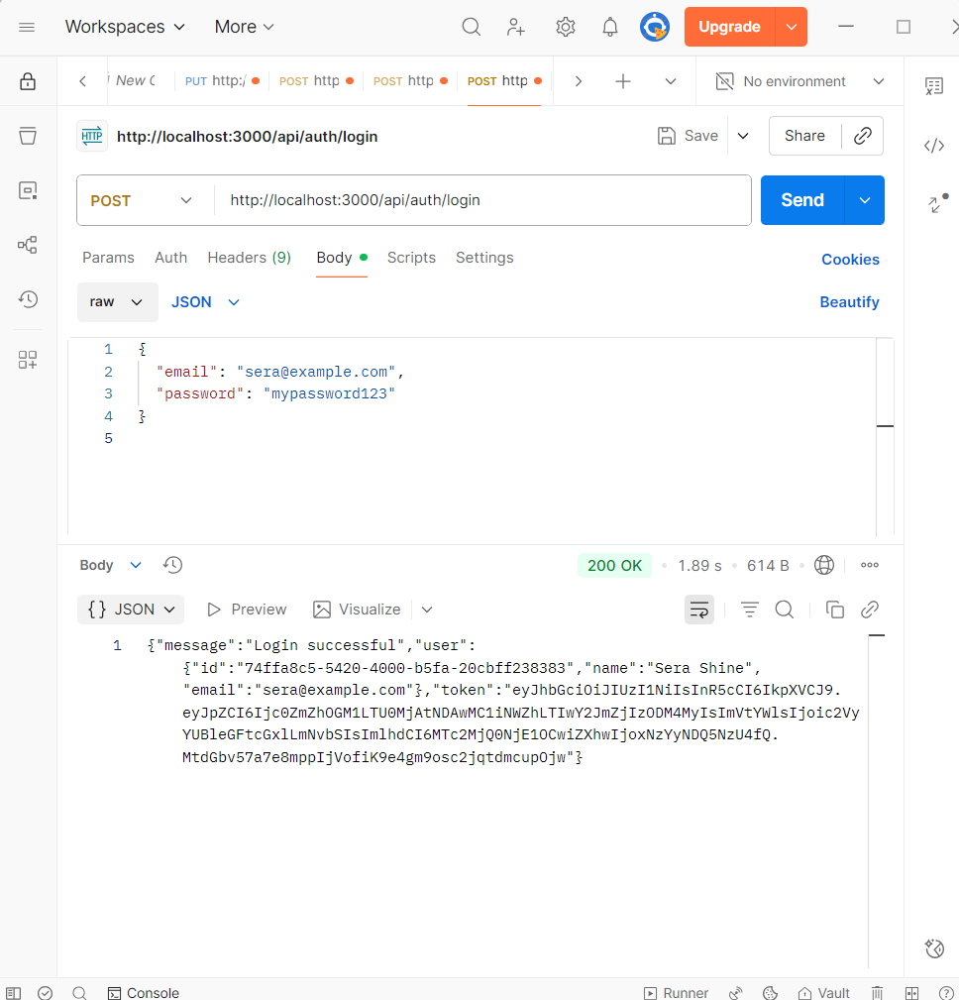
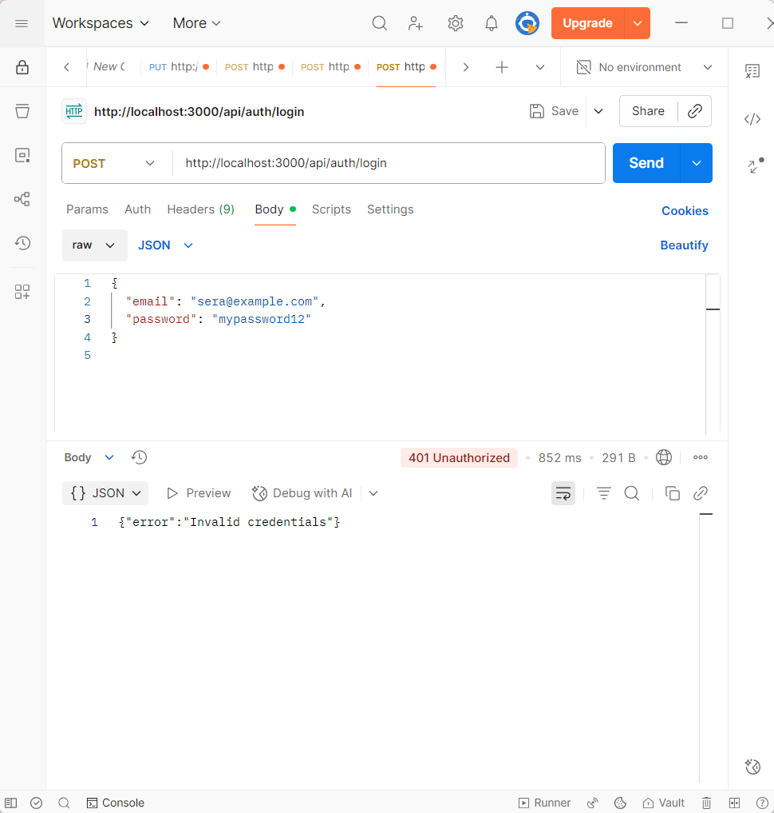
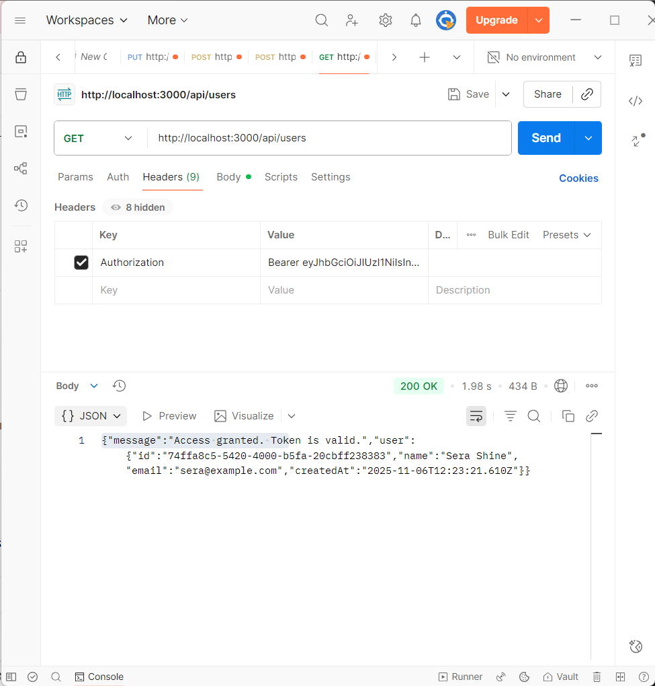
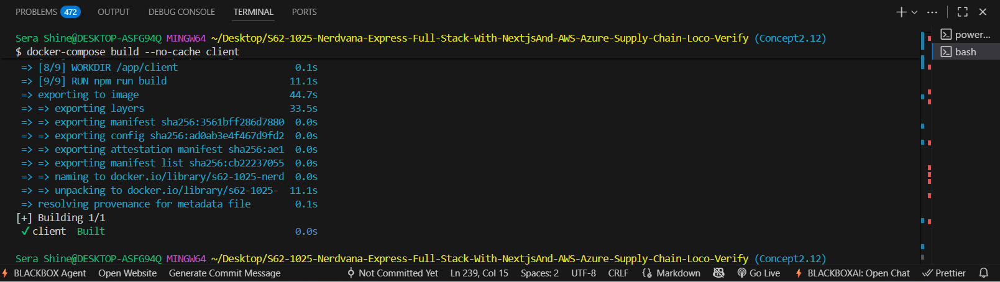

# Loco Verify

## Problem Statement
Railway vendors such as tea stalls and bookshops still depend on manual, paper-based processes for license applications and renewals. How can digitizing this workflow improve efficiency, transparency, and accessibility for both vendors and railway officers?

## Solution
Loco Verify streamlines the entire vendor license management process — from initial registration to verification, approval, and periodic renewal. Vendors can upload essential documents online, while officials can seamlessly review, verify, and manage approvals through a unified dashboard.

---

## Key Features

- **Vendor Onboarding:** Vendors can easily register by submitting their ID proofs, shop images, and selecting the relevant license category.
- **Digital Review System:** Authorized officers can digitally inspect uploaded documents and approve or decline license requests.
- **Renewal Requests:** Vendors can conveniently initiate renewal requests before license expiry, ensuring uninterrupted operations.
- **Automated Notifications:** (Optional) Email or SMS alerts keep vendors informed about approval updates and upcoming renewal dates.

---

## Technology Stack

- **Next.js** — For building both the user interface and backend APIs within one framework.
- **PostgreSQL + Prisma ORM** — Handles structured vendor data with efficient schema management.
- **AWS S3** — Provides secure and scalable cloud storage for uploaded verification documents.
- **GitHub Actions** — Powers continuous integration and deployment workflows for smooth updates.

---

## Folder Structure
src/
├── app/ # Page routes and layouts powered by Next.js App Router
├── components/ # Modular UI elements such as forms, tables, and alerts
├── lib/ # Helper functions, API utilities, and database connections
├── prisma/ # Prisma schema definitions and migration records
├── styles/ # Centralized and component-specific style sheets


---

## Setup Instructions

1. Clone the repository and move into the project directory:
   ```bash
   git clone https://github.com/yourusername/loco-verify.git
   cd loco-verify
Install required dependencies:

npm install

Create a .env file with the following values:

DATABASE_URL=your_postgres_connection_string
AWS_ACCESS_KEY_ID=your_aws_key
AWS_SECRET_ACCESS_KEY=your_aws_secret
NEXT_PUBLIC_AWS_S3_BUCKET=your_s3_bucket_name

Apply database migrations:


npx prisma migrate dev
Launch the development server:

npm run dev

Open the app in your browser at:

http://localhost:3000

## Reflection
This setup ensures a clean separation of concerns, making collaboration between developers smoother and the project easy to scale. It encourages maintainability, allowing new features like analytics or vendor performance tracking to be integrated with minimal friction.



## TypeScript & ESLint Configuration

Strict TypeScript Mode
Ensures better type safety and reduces runtime errors by enforcing strict rules like noImplicitAny, noUnusedLocals, and consistent casing.

ESLint + Prettier Setup

ESLint detects code issues and ensures best practices.

Prettier automatically formats code for readability.

Configurations enforce semicolons, double quotes, and prevent console logs.

Pre-Commit Hooks (Husky + lint-staged)
Automatically runs lint and formatting checks before commits, ensuring all code entering the repo is clean and consistent.


## Prisma Setup Summary

- Installed Prisma ORM and generated initial setup with `npx prisma init`.
- Configured the database connection using `DATABASE_URL` in `.env`.
- Defined data models for Vendors, Licenses, and Admins in `schema.prisma`.
- Ran `npx prisma migrate dev` to apply schema changes to the database.
- Generated the Prisma client for use in the app’s API routes.

Screenshot : 


##  Authentication Module (Signup & Login)

###  Flow Overview

**Signup Flow**
1. User sends `name`, `email`, and `password` to `/api/auth/signup`.
2. The server checks if the email already exists in the database.
3. If not, the password is securely **hashed using bcrypt**.
4. Prisma inserts the new user into the `User` table.
5. The server returns a success response with user details (excluding password).

**Login Flow**
1. User sends `email` and `password` to `/api/auth/login`.
2. The server finds the user by email.
3. The entered password is compared with the stored **hashed password** using bcrypt.
4. If valid, a **JWT token** is generated and returned.
5. The token is used to authenticate further API requests.

---

### 📬 Sample API Requests and Responses

**Signup Request**

POST /api/auth/signup
{
  "name": "Sera Shine",
  "email": "sera@example.com",
  "password": "mypassword123"
}

**Signup Success Response**
{
  "message": "User created successfully",
  "user": {
    "id": "cltxx12345",
    "name": "Sera Shine",
    "email": "sera@example.com",
    "createdAt": "2025-11-06T12:00:00.000Z"
  }
}

**Signup Failure Response**
{
  "error": "User already exists"
}

**Login Request**
POST /api/auth/login
{
  "email": "sera@example.com",
  "password": "mypassword123"
}

**Login Success Response**
{
  "message": "Login successful",
  "token": "eyJhbGciOiJIUzI1NiIsInR5cCI6IkpXVCJ9...",
  "user": {
    "id": "cltxx12345",
    "name": "Sera Shine",
    "email": "sera@example.com"
  }
}

**Login Failure Response**
{
  "error": "Invalid email or password"
}

### Password Hashing & JWT Explanation

**Password Hashing:**
Implemented using bcrypt. Before saving to the database, passwords are converted into irreversible hashed strings, ensuring credentials remain secure even if the database is exposed.

**JWT Generation:**
Upon successful login, a JWT (JSON Web Token) is created using a secret key.

It contains the user’s ID and email.

It allows stateless authentication for subsequent requests.

### Token Expiry & Storage

**Token Expiry:** Tokens are set to expire after 1 hour for security.

**Storage Options:**

HTTP-only cookies → safer, prevents XSS attacks.

localStorage/sessionStorage → easier for front-end management but more vulnerable.

**Refresh Strategy:**

Implement a /api/auth/refresh endpoint that issues a new token when the old one expires.

Store short-lived access tokens and long-lived refresh tokens separately.

**Screenshots :**

1. **Signup successful**:
2. **Signup error**:
3. **Login successful**:
4. **Login error**:
5. **Token Verification**:

##  Concept 2.21 — Authorization Middleware

Implemented a reusable middleware in Next.js to enforce **Role-Based Access Control (RBAC)** using JWT verification.  
- Protected routes based on roles: `Official` (admin) and `Vendor` (user).  
- Added middleware to validate tokens and restrict unauthorized access.  
- Tested access for both roles using `/api/admin` and `/api/users` routes.  

**Screenshots**:
1.Successful Official access: 
2.Officials access denied for vendor:

\
## Concept 2.12 — Docker & Compose Setup for Local Development

In this unit, I set up **Docker** and **Docker Compose** to run the full-stack application in containers.  
I created a **Dockerfile** for the Next.js client and a **docker-compose.yml** file to connect the app with **PostgreSQL** and **Redis**.  
This setup ensures that all services run together smoothly in a local environment, similar to production.

### Highlights
- Built a Dockerfile using **Node.js 20-slim** for the Next.js client.  
- Configured **docker-compose.yml** to include services for the app, database, and Redis cache.  
- Used environment variables, shared networks, and volumes for seamless integration.  

### Reflection
This configuration makes development easier and more consistent across systems.  
It helps eliminate environment issues and allows the entire project to run with one command:

docker-compose up --build

**Screnshot**: 

## Error Handling Middleware

This project implements a centralized error handling system that ensures consistent error responses and secure logging across all API routes.

### Features

- **Structured Error Responses**: All errors follow a consistent JSON format
- **Environment-aware**: Detailed errors in development, user-friendly messages in production
- **Structured Logging**: JSON-formatted logs for easy monitoring and debugging
- **Security**: Stack traces hidden in production, sensitive data redacted
